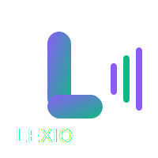
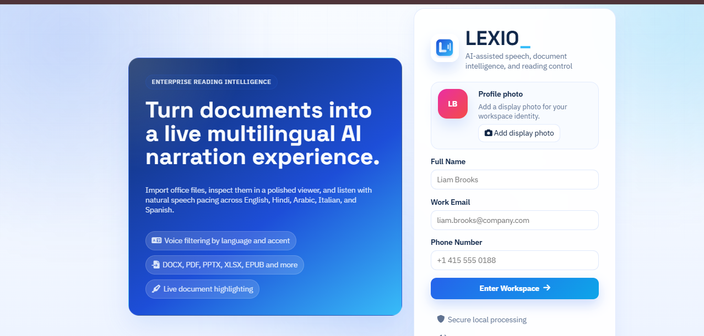
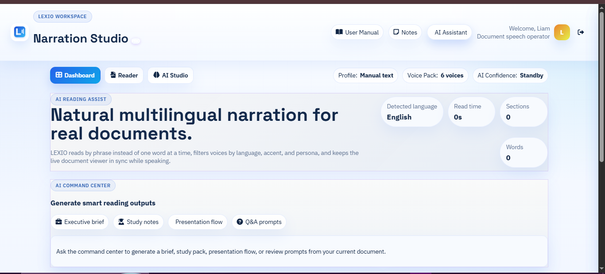
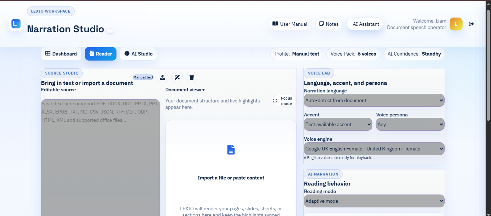
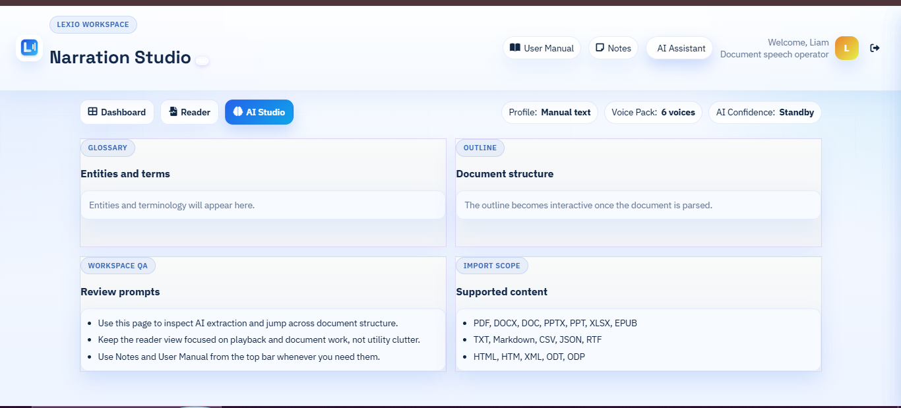

<p align="center">
  
</p>
<h1 align="center">LEXIO</h1>
<p align="center">
  A premium multilingual reading workspace for document narration, synchronized highlighting, and AI-assisted reading control.
</p>
<p align="center">
  <a href="https://voxion-labs.github.io/LEXIO/">Live Product</a>
  |
  <a href="https://github.com/liambrooks-lab/LEXIO">Repository</a>
</p>

---

## ✨ Overview
LEXIO is a browser-based AI reading workspace built to turn real documents into a polished multilingual narration experience. It combines document import, live text highlighting, voice filtering by language and accent, guided playback controls, structured reading modes, and AI-style document assistance inside one clean product interface.

---

## 🧭 What Is LEXIO?
LEXIO is a front-end narration studio for users who want one workspace for reading, listening, reviewing, and understanding documents more efficiently.

At the product level, LEXIO acts as:
- a multilingual document reader
- a browser-based AI-assisted text-to-speech workspace
- a structured office-file narration interface
- a document review tool with summaries, glossary, topics, and Q&A support

---

## 🩺 Problem It Solves
Most text-to-speech tools fail in the places that matter during actual document work:

- they only handle plain text comfortably
- imported files lose structure or readability
- playback feels robotic and hard to follow
- users cannot stay visually synced with spoken output
- there is no integrated space for summaries, notes, or document review help

LEXIO solves that by giving users a cleaner end-to-end reading flow:
- import or paste content
- rebuild it into readable sections
- choose better voice settings by language, accent, and persona
- listen with live word highlighting and progress tracking
- use AI-style outputs for briefing, studying, presenting, and reviewing

---

## 🔗 Links
- **[View LEXIO Live](https://voxion-labs.github.io/LEXIO/)**
- **[GitHub Repository](https://github.com/liambrooks-lab/LEXIO)**
- **[Issues](https://github.com/voxion-labs/LEXIO/issues)**

---

## 🚀 Latest Product State
LEXIO currently ships with:

- a branded login and workspace identity flow
- `Dashboard`, `Reader`, and `AI Studio` workspace views
- browser speech synthesis with multilingual voice filtering
- live document rendering with clickable word playback
- AI reading modes such as `Executive`, `Study`, `Presentation`, and `Accessibility`
- smart cleanup and natural chunking for smoother narration
- side panels for `User Manual`, `Notes`, and `AI Assistant`
- document analytics including words, sections, characters, and estimated read time
- support for office, text, markup, and ebook formats

---

## 🌌 Core Highlights
- polished workspace onboarding and product-style UI
- synchronized live highlighting during narration
- language, accent, and persona-based voice selection
- drag-and-drop import for real document formats
- AI-style outputs for executive brief, study notes, presentation flow, and review prompts
- local notes and document-aware assistant support
- responsive layout for desktop and presentation use
- modular JavaScript structure across import, speech, AI, auth, and utilities

---

## 🧩 Product Surface
### Workspace experience
- premium login screen with profile photo upload
- workspace navigation across `Dashboard`, `Reader`, and `AI Studio`
- identity, voice pack, and AI confidence chips in the top bar
- keyboard shortcuts for faster control across views and tools

### Reading experience
- source editor for pasted or typed content
- document viewer that rebuilds imported content into synchronized sections
- playback controls for start, pause, resume, and stop
- focus mode and progress tracking for long reading sessions

### AI assist experience
- executive brief generation
- study note generation
- presentation flow guidance
- glossary extraction
- topic extraction
- Q&A and review prompt generation

---

## 🖼️ Demo Gallery
<table>
  <tr>
    <td width="50%" valign="top">
      
      <br />
      <strong>1. Workspace entry and branding</strong>
      <br />
      LEXIO opens with a polished product-style login flow where users can add a display photo and enter a document narration workspace that feels structured and premium.
    </td>
    <td width="50%" valign="top">
      
      <br />
      <strong>2. Dashboard and AI reading assist</strong>
      <br />
      The dashboard focuses on AI reading outputs, quick commands, live document metrics, and a strong overview of the current reading workspace.
    </td>
  </tr>
  <tr>
    <td width="50%" valign="top">
      
      <br />
      <strong>3. Reader and voice lab</strong>
      <br />
      The reader view combines content import, document rendering, voice filtering, narration controls, and synchronized reading flow in one focused layout.
    </td>
    <td width="50%" valign="top">
      
      <br />
      <strong>4. AI Studio and document inspection</strong>
      <br />
      AI Studio helps users inspect glossary terms, structure outline, review prompts, and supported import scope without cluttering the main reading view.
    </td>
  </tr>
</table>

---

## 💡 Why LEXIO
LEXIO is built around a simple product promise:
- bring in a real document
- make it easier to follow
- make it easier to listen to
- make it easier to understand

That promise shapes the UI, the narration flow, the document viewer, and the AI assist layer across the project.

---

## 🌍 Language Support
LEXIO supports multilingual narration controls and multi-format document reading for real-world content workflows.

### Narration languages
- English
- Hindi
- Arabic
- Italian
- Spanish

### Supported import formats
- PDF
- DOCX
- DOC
- PPTX
- PPT
- XLSX
- EPUB
- TXT
- Markdown
- CSV
- JSON
- RTF
- HTML
- HTM
- XML
- ODT
- ODP

---

## 🛠️ Tech Stack
### Core frontend
- HTML5
- CSS3
- JavaScript (ES6+)

### Browser capabilities
- Web Speech API
- DOM APIs
- Local Storage

### Document parsing
- PDF.js
- Mammoth.js
- JSZip
- SheetJS

### UI resources
- Font Awesome
- Google Fonts

---

## 🧱 Project Structure
```text
LEXIO/
|- assets/
|  |- favicon.ico.ico
|  `- logo.svg
|- css/
|  `- components.css
|- docs/
|  |- API.md
|  |- CHANGELOG.md
|  |- CONTRIBUTING.md
|  `- readme/
|     |- author-rudranarayan-jena.jpg
|     |- lexio-ai-studio.png
|     |- lexio-dashboard.png
|     |- lexio-login.png
|     `- lexio-reader.png
|- js/
|  |- ai.js
|  |- auth.js
|  |- fileHandler.js
|  |- speech.js
|  `- utils.js
|- index.html
|- LICENSE
|- package.json
|- README.md
|- script.js
`- styles.css
```

---

## 🏗️ Architecture
### Frontend responsibilities
- workspace onboarding and identity flow
- document rendering and analytics
- playback control and active-word synchronization
- notes, manual, and assistant side panels
- dashboard and AI studio presentation

### Import and reading flow
1. User pastes content or imports a supported file.
2. LEXIO parses the file based on its format.
3. The content is normalized into readable sections.
4. The document viewer renders clickable word-level reading blocks.
5. The speech layer generates narration with synced highlighting.
6. The AI layer refreshes summaries, topics, glossary, and prompts.

### Speech behavior
- voice selection is filtered by language, accent, and persona
- reading is chunked naturally for smoother playback
- progress and active-word state stay aligned with narration
- supported voices depend on browser and operating system voice packs

---

## ✅ Validation Snapshot
The current repo state includes:
- modular JavaScript split into `auth`, `speech`, `fileHandler`, `ai`, and `utils`
- local run scripts through `live-server`
- real document import handling for multiple formats
- no dedicated automated test suite yet beyond the placeholder npm script

---

## 📦 Key Capabilities
- branded reading workspace
- multilingual document narration
- live highlighted playback
- office-file and ebook import support
- AI reading modes and summary-style outputs
- notes, assistant, and manual panels
- keyboard shortcuts for faster navigation
- responsive static deployment suitable for demos and portfolio presentation

---

## 🎯 Current Scope
LEXIO is currently positioned as a polished front-end MVP with:
- real document import
- multilingual speech playback
- structured dashboard and reader flows
- AI-assisted reading outputs
- local identity and notes support
- a live static deployment link

---

## 🧪 Local Setup
### Prerequisites
- Node.js `14+`
- npm `6+`
- a modern browser with Web Speech API support

### Install dependencies
```bash
npm install
```

### Run local development server
```bash
npm run dev
```

### Alternate start command
```bash
npm start
```

### Local URL
- `http://localhost:3000`

---

## 🏁 Build Commands
### Start development
```bash
npm run dev
```

### Start local preview
```bash
npm start
```

### Test placeholder
```bash
npm test
```

---

## 🌐 Deployment
### Live deployment
- hosted as a static web experience
- public product URL: [https://voxion-labs.github.io/LEXIO/](Click to visit URL)

### Deployment profile
- lightweight browser-first frontend
- no separate backend service required
- speech output depends on the client browser environment

---

## 📄 License

LEXIO is protected under a custom restricted license.

The full license text is available in [LICENSE](LICENSE).

License summary:

- copyright © 2026 Rudranarayan Jena
- all rights reserved
- no copying, modification, distribution, hosting, reuse, or derivative work without prior written permission
- no commercial or non-commercial use is allowed unless explicitly approved by the author

LEXIO is not released as an open-source project under MIT, Apache, GPL, or any other permissive/public license.

---

## 👨‍💻 Author
<p align="center">
  
</p>
<p align="center">
  <strong>Crafted by Rudranarayan Jena</strong>
</p>
<p align="center">
  <strong>Founder @ Voxion Labs</strong>
</p>
<p align="center">
  Focused on building polished browser products, multilingual reading experiences, and AI-assisted interfaces that feel like complete software products.
</p>
<p align="center">
  <a href="https://github.com/liambrooks-lab">GitHub: @liambrooks-lab</a>
</p>

---
